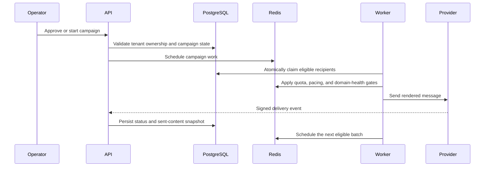

# Sendex Architecture

## System boundaries

Sendex is split into a browser control plane and a queue-driven delivery service.

- **Frontend:** authenticated React application for campaigns, templates, lists, inboxes, replies, queue status, settings, and staged imports.
- **API:** FastAPI routers enforce ownership, validate requests, persist state, and expose operational controls.
- **Database:** PostgreSQL stores users, campaigns, recipients, templates, inboxes, messages, warm-up state, replies, and audit data.
- **Queue:** Redis stores prioritized jobs, processing leases, rate-limit counters, cooldown state, and staged assistant context.
- **Workers:** timezone-scoped processes claim recipients atomically, render content, enforce safety gates, send messages, and persist outcomes.
- **Providers:** Resend and SMTP deliver messages; IMAP and signed webhooks feed replies and delivery events back into the platform.

## Campaign delivery lifecycle

## Important design decisions

### Tenant isolation

Every user-owned resource is filtered by the authenticated user at the query boundary. Nested resources are authorized through their owning campaign, list, inbox, or account. Administrative access is explicit rather than inferred.

### Atomic campaign claims

Workers claim recipients before enqueueing to prevent duplicate sends across concurrent processes. Processing leases and reconciliation release abandoned claims only when no corresponding Redis job exists.

### Delivery safety

Quota and domain-health decisions are separate states with separate user-facing reasons. Daily bounce counts are deduplicated by provider message ID, and hard safety limits can stop new sends immediately after a webhook event.

### Immutable send evidence

New deliveries retain the rendered subject, body, sender, and template identity used at send time. Older records can be reconstructed for operator visibility but are clearly labeled as reconstructed rather than exact snapshots.

### Staged assistant imports

Archive analysis is non-mutating. The assistant inventories files, predicts create/reuse/update counts, maps templates to lists and senders, and collects custom values. Only a reviewed approval materializes resources, and campaign drafts still require confirmation.

## Operational model

- Separate workers can be scoped by timezone.
- Redis-backed cooldowns survive process restarts.
- Health and worker-heartbeat checks feed Telegram alerts.
- Environment loading gives explicit runtime configuration priority over local files.
- Test Redis uses an isolated database and production data is excluded from source control.
