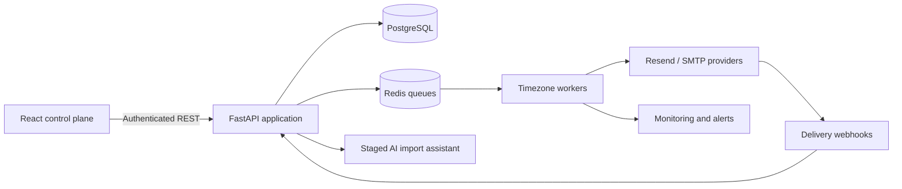

# Sendex

**Production-tested email operations platform for orchestrating campaigns, sender health, and delivery workflows.**

> Operational milestone: the deployed system has processed more than **12,000 emails** while evolving through real campaign, deliverability, and multi-tenant requirements.

Sendex is a full-stack control plane for teams that need reliable email campaign execution rather than a simple “send” button. It combines a React dashboard with a FastAPI service, PostgreSQL persistence, Redis-backed scheduling, sender warm-up, webhook processing, delivery analytics, and a staged AI-assisted import workflow.

## Why this project stands out

- **Production traffic:** 12,000+ emails processed through the live system.
- **Queue-driven delivery:** atomic recipient claims, retry-safe jobs, priorities, cooldowns, timezone-aware workers, and recovery for interrupted work.
- **Deliverability controls:** sender warm-up, per-domain pacing, daily quotas, bounce/complaint circuit breakers, and webhook deduplication.
- **Multi-tenant security:** ownership checks at query boundaries, authenticated APIs, signed tracking links, webhook verification, and cross-tenant regression coverage.
- **Campaign observability:** recipient-level status, sender/template attribution, exact sent-content snapshots, historical preview reconstruction, replies, bounces, and activity logs.
- **Safe AI assistance:** bundle imports are staged and reviewed before mutation; ambiguous templates, lists, senders, or custom values require explicit confirmation.
- **Operational tooling:** health endpoints, Telegram worker alerts, database migrations, queue inspection, and production-oriented environment loading.

## Technology

| Layer | Stack |
| --- | --- |
| Frontend | React 19, TypeScript, Vite, Tailwind CSS, SWR, Axios, Vitest |
| API | FastAPI, Pydantic, SQLAlchemy, Uvicorn |
| Data | PostgreSQL, Redis |
| Delivery | Resend API, SMTP, IMAP, signed webhooks and tracking |
| Operations | systemd workers, health monitoring, Telegram alerts |
| Quality | Pytest, Ruff, ESLint, TypeScript, production builds |

## Repository branches

| Branch | Purpose |
| --- | --- |
| `main` | Complete portfolio-ready application and documentation |
| `frontend` | React/TypeScript dashboard history and frontend source |
| `server` | FastAPI/worker history and backend source |

The feature branches remain available to make each side of the architecture easy to review independently.

## Architecture



See [ARCHITECTURE.md](ARCHITECTURE.md) for the main boundaries, delivery lifecycle, and safety guarantees.

## Local development

### Prerequisites

- Python 3.12+
- Node.js 20+
- PostgreSQL 15+
- Redis 7+

### Backend

```bash
cd server
python -m venv .venv
source .venv/bin/activate
pip install -r requirements-dev.txt
cp env/.env.example env/.env
uvicorn main:app --reload --host 0.0.0.0 --port 8090
```

### Frontend

```bash
cd Frontend
npm ci
cp .env.example .env.local
npm run dev
```

The Vite development server runs on port `3001` and proxies API requests to port `8090`.

## Verification

```bash
cd server
TEST_REDIS_URL=redis://localhost:6379/15 pytest
ruff check .

cd ../Frontend
npm test
npm run lint
npm run build
```

Current verified baseline: **125 backend tests** and **17 frontend tests**, plus clean lint and production builds.

## Responsible use

Sendex is intended for permission-based, transactional, internal, or otherwise lawful email workflows. Operators are responsible for consent, suppression handling, privacy obligations, provider policies, and applicable anti-spam laws. Built-in unsubscribe, throttling, bounce, complaint, and domain-health controls should not be removed in production.

## Security

Production credentials and customer data are intentionally excluded. Never commit `.env` files, provider keys, database dumps, Redis snapshots, uploads, recipient exports, or logs. See [SECURITY.md](SECURITY.md) for reporting guidance.
